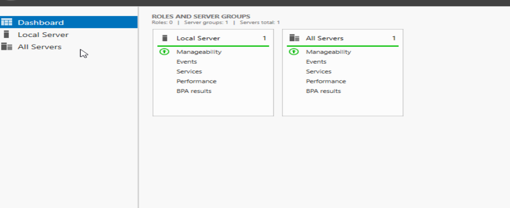
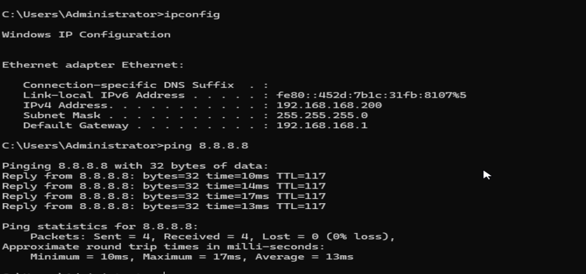

# Part 1: Windows Server 2025 Base OS Installation & Static IP Setup

This module covers the initial setup of the base server operating system and the deployment of structural network configurations required before running directory services.

## 🛠️ Lab Specifications
* **Operating System:** Windows Server 2025 Standard Edition
* **Hypervisor Platform:** Oracle VM VirtualBox
* **Static Server IP Target:** `192.168.168.200`
* **Network Gateway Route:** `192.168.168.1`

---

## 📋 Lab Execution Steps

### 1. Provision the Virtual Compute Instance
* Create a fresh virtual machine inside the hypervisor manager with appropriate storage allocation to hold the server files.
* Mount the official Windows Server 2025 Standard ISO file directly to the virtual optical disk slot.

### 2. Install the Base Operating System
* Start the virtual machine and advance past the initial language configuration screen.
* Select **Windows Server 2025 Standard (Desktop Experience)** to ensure full administrative GUI access rather than a core command-line deployment.
* Choose custom installation parameters, select the unallocated virtual hard drive space, and format the storage drive partition.
* Complete the automated file extraction loop, define the master administrative password upon system reload, and log into the desktop.

🖼️ 

### 3. Lock in a Static IPv4 Address
Servers require fixed addresses to ensure connected workstation components can reliably communicate without identity drift.
* Execute `Win + R` on the keyboard, type `ncpa.cpl`, and hit Enter to jump directly to the Network Connections dashboard.
* Right-click the primary Ethernet network adapter and select **Properties**.
* Highlight **Internet Protocol Version 4 (TCP/IPv4)** and select **Properties**.
* Manually assign the static network variables:
  * **IP Address:** `192.168.168.200`
  * **Subnet Mask:** `255.255.255.0`
  * **Default Gateway:** `192.168.168.1`
  * **Preferred DNS Server:** `127.0.0.1`
* Click **OK** and then **Close** to save and apply the new network identity configuration.

🖼️ 

*Note:* Setting the Preferred DNS to the `127.0.0.1` loopback address forces the operating system to target its own local zone records once the Active Directory role takes over name resolution duties.
