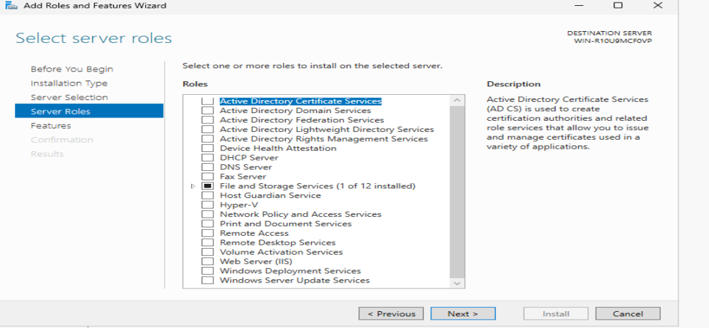
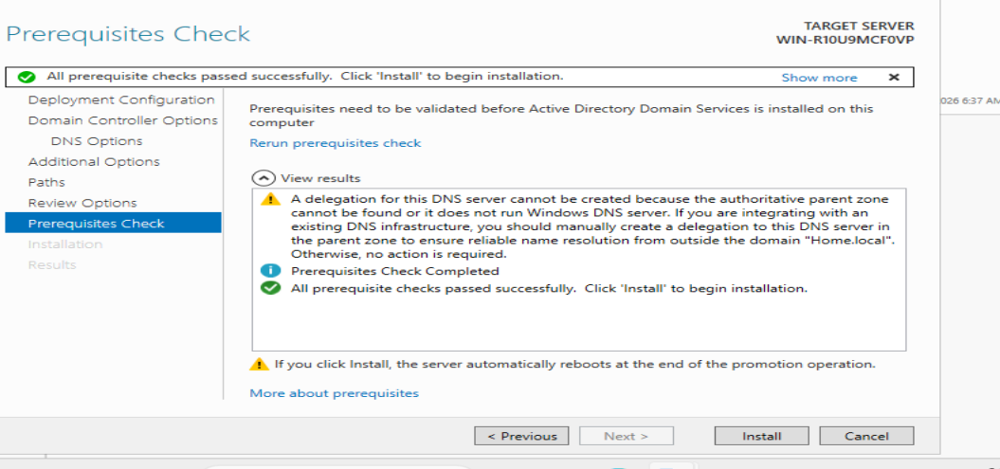
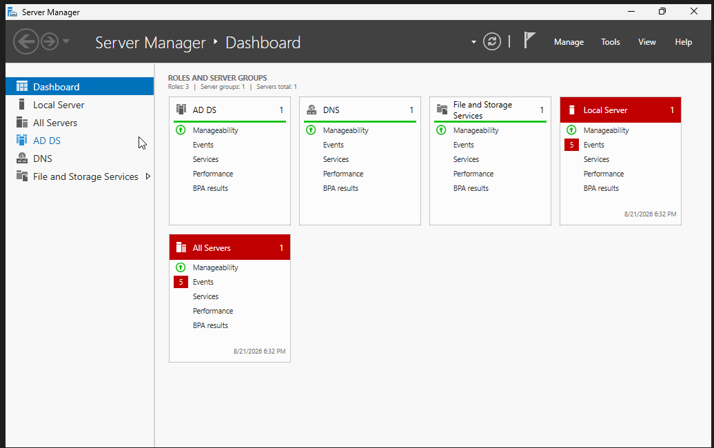

# Part 2: Active Directory Domain Services & Domain Controller Provisioning

This module handles the core installation of Active Directory and the official promotion of the standalone server into an authoritative network Domain Controller.

## 🛠️ Infrastructure Parameters
* **Target Domain Forest:** `home.local`
* **NetBIOS Suffix:** `HOME`
* **Primary Identity Database:** Active Directory Users and Computers (ADUC)

---

## 📋 Lab Execution Steps

### 1. Install the Active Directory Core Files
* Open the **Server Manager Dashboard** inside the Windows Server VM.
* Click **Manage** at the top right and select **Add Roles and Features Wizard**.
* Select **Role-based or feature-based installation** to install functional binaries directly onto the local OS layer.
* Check the box for **Active Directory Domain Services (AD DS)**.
* On the automatic popup window, click **Add Features** to include the required directory management tools and console snap-ins.

* Leave the default **File and Storage Services** checked since Active Directory depends on it to handle disk partitions and folder structures later.
* Advance through the menu and click **Install** to start the file extraction.

### 2. Promote the Server to a Domain Controller
* Clean up any pending background system processes by performing a quick, planned restart of the Server VM.
* Once logged back into the desktop, click the **Yellow Warning Flag** ⚠️ at the top right of Server Manager.
* Click the link: **"Promote this server to a domain controller"** to start the configuration wizard.
* Choose the third option: **Add a new forest** and type the private network domain namespace: `home.local`.
* Leave the functional levels on **Windows Server 2025** and type in a secure directory restore password.
* Bypass the built-in DNS delegation warning. (This alert is expected because a private sandbox domain ending in `.local` cannot authenticate with real internet registrars).
* Verify that the wizard auto-generates the legacy pre-Windows 2000 login prefix as `HOME`.
* Review the prerequisites check page, confirm the green success checkmark appears, and click **Install**. 

* The server will configure the security databases and reboot automatically.

### 3. Verify Domain Health & Create a Test Account
* After the reboot, check the Windows lock screen to confirm it updated the security authority prefix to **`HOME\Administrator`**.
* Open Server Manager and verify that **AD DS** and **DNS** are actively running on the left navigation column.

* Go to **Tools > Active Directory Users and Computers**.
* Expand the `home.local` domain folder, right-clicked the standard **Users** directory container, and select **New > User**.
* Create a fresh end-user login identity (such as `user1`) and assign a fixed password to use during client workstation testing.
