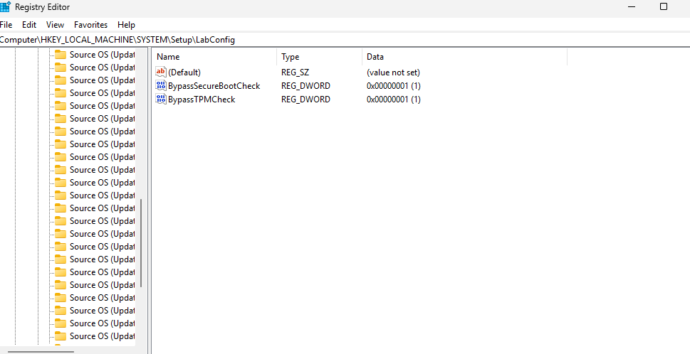
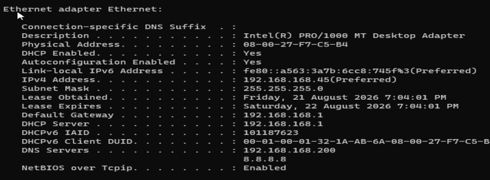
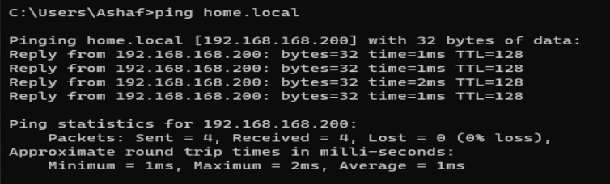
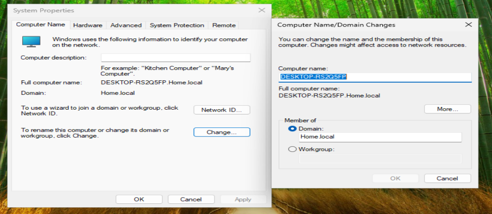
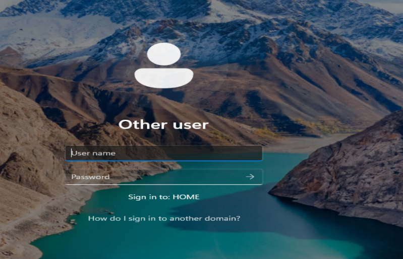
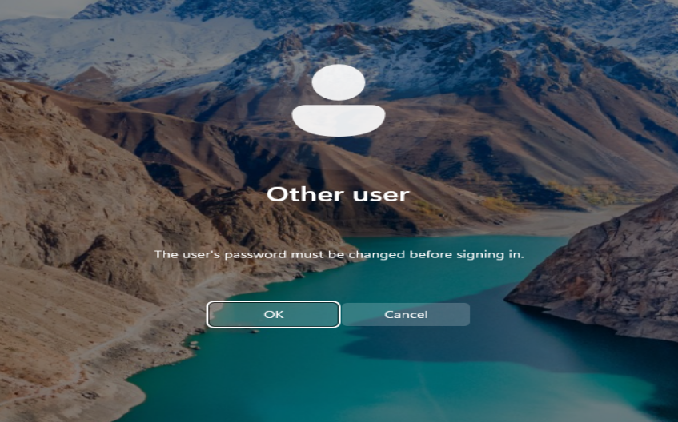

# Part 3: Windows 11 Enterprise Workstation Client Onboarding

This module covers bypassing Windows 11 virtual hardware restrictions, configuring client-side DNS routing parameters, and establishing an authenticated computer account relationship inside the local Active Directory domain controller.

## 🛠️ Workstation Specifications
* **Operating System:** Windows 11 Enterprise Edition
* **Target Domain Mapping:** `home.local` (NetBIOS: `HOME`)
* **Primary DNS Target Route:** `192.168.168.200` (Windows Server Static IP)
* **Local Fallback Admin Profile:** `LocalAdmin`

---

## 📋 Lab Execution Steps

### 1. Bypass Virtual Hardware Blockers & Install Windows 11
* Initialize the Windows 11 Enterprise VM installer within VirtualBox.
* Upon hitting the *"This PC doesn't meet Windows 11 system requirements"* blocker page, execute `Shift + F10` (or `Fn + Shift + F10`) to trigger the Command Prompt.
* Execute `regedit` to launch the Windows Registry Editor.
* Navigate to the target registry branch: `HKEY_LOCAL_MACHINE\SYSTEM\Setup`
* Right-click the **Setup** folder, create a new sub-key, and name it exactly: `LabConfig`
* Inside the new `LabConfig` directory window, right-click the blank canvas space and provision two fresh **DWORD (32-bit) Value** entries:
  * Name: `BypassTPMCheck` ➔ Double-click to set value data string to `1`
  * Name: `BypassSecureBootCheck` ➔ Double-click to set value data string to `1`
* Terminate the Registry Editor and Command Prompt windows.
* Click the **Back arrow** on the installer setup UI window to refresh execution logic, advance forward, target the unallocated virtual storage block, and let file installation complete.

🖼️ 

### 2. Configure Client-Side Network Properties
* Advance past the out-of-box user experience privacy toggles, skip online Microsoft account authentication prompts, and configure a temporary fallback workstation profile named `LocalAdmin`.
* Once loaded onto the local desktop screen, execute `Win + R`, enter `ncpa.cpl`, and launch Network Connections.
* Open the target properties for the active network adapter, highlight **Internet Protocol Version 4 (TCP/IPv4)**, and select **Properties**.
* Leave the top IP addressing rules on automatic DHCP parameters.
* Modify the bottom section to select **"Use the following DNS server addresses"** and link the workstation directly to the server's phonebook:
  * **Preferred DNS Server:** `192.168.168.200`
* **Avoid Protocol Conflict:** Scroll through the active adapter checklist and uncheck **Internet Protocol Version 6 (TCP/IPv6)** to prevent background address lookup interference.
* Click **OK** and then **Close** to commit the settings change.

🖼️ 

### 3. Verify Name Resolution Pathways (The Ping Test)
* Launch Command Prompt on the Windows 11 workstation.
* Run a connectivity diagnostic query: `ping home.local`
* Confirm that packet transport statistics show an immediate, successful response return map pointing back to the server identity address (`192.168.168.200`) with 0% data packet loss.

🖼️ 

### 4. Migrate Workstation to the Active Directory Domain
* Execute `Win + R`, enter `sysdm.cpl`, and open System Properties.
* Locate the bottom workspace configuration panel and click **Change...**.
* Toggle the *Member of* operational checkbox from *Workgroup* over to **Domain**.
* Enter the corporate target string exactly: `home.local` and click **OK**.
* Authenticate the network change by providing the master server directory admin credentials:
  * **Username:** `Administrator`
  * **Password:** *[Your Windows Server master administrative password]*
* Acknowledge the confirmation dialog prompt stating: *"Welcome to the home.local domain."* 
* Click **OK** on system alert popups and initialize a planned workstation restart to apply network machine policies.

🖼️ 

### 5. Validate Domain Authentication Loop
* Upon workstation reboot initialization, advance past the standard profile lock screen and click **Other User** located at the bottom-left corner of the authentication interface.
* Input the parameters for the Active Directory identity built during the server configuration phase (`user1`).
* Verify that the network tracking field running directly underneath the password cell updates to state: **"Sign in to: HOME"**.

* Upon executing the login command, verify that the active directory database successfully intercepts the authentication handshake and forces corporate credential updates based on active domain security constraints.

---

## ⚠️ Critical Troubleshooting & Obstacle Overrides

During environment setup, several virtual infrastructure blockers were encountered and resolved:

### 🛑 Blocker 1: Post-Extraction Infinite Boot Loops & Black Screen Freezes
* **The Issue:** After completing the 100% file extraction phase, the Windows 11 VM restarted and froze completely on a black screen. This occurs because the VM tries to read the installation ISO file continuously from the virtual optical drive instead of handing boot execution over to the newly written virtual hard drive.
* **The Resolution:** Force-closed the VM execution thread. Navigated to VirtualBox **Settings > Storage**, highlighted the optical controller slot containing the Windows 11 installer ISO file, and clicked **Remove Disk from Virtual Drive** to switch the slot status back to `[Empty]`. Re-powering the VM forced it to boot directly from its internal storage partition and load the desktop layout normally.

### 🛑 Blocker 2: DNS Resolution Failures (`ping home.local` Could Not Be Found)
* **The Issue:** Even though the Windows 11 network properties explicitly targeted the server's static IP address, running a domain ping query failed to discover the `home.local` namespace.
* **The Resolution:** Diagnosed a two-part routing interruption. First, discovered that the core Windows Server VM was temporarily powered off on the hypervisor host (directory servers must remain actively executing to answer live namespace queries). Second, disabled the default strict Windows Defender Firewall profiles inside the server (`firewall.cpl`) across Domain, Private, and Public network scopes to ensure incoming diagnostic client request traffic could pass safely.

### 🛑 Blocker 3: Local Hypervisor System Resource Overloads
* **The Issue:** Attempting to execute three massive infrastructure operating systems simultaneously (Windows Server, Windows 11, and an experimental Ubuntu environment) completely bottlenecked the laptop host's physical RAM and storage disk I/O performance. This resource logjam caused universal system freezes and black screens across all running VMs.
* **The Resolution:** Safely scaled down infrastructure operations by hard-killing the non-essential Ubuntu VM to return processing overhead back to the computer. Optimized the surviving VMs by increasing CPU Core allocation from single-thread parameters up to multi-core limits and checked the **"Use Host I/O Cache"** flag box under the storage settings panel to clear active storage disk lag loops.
